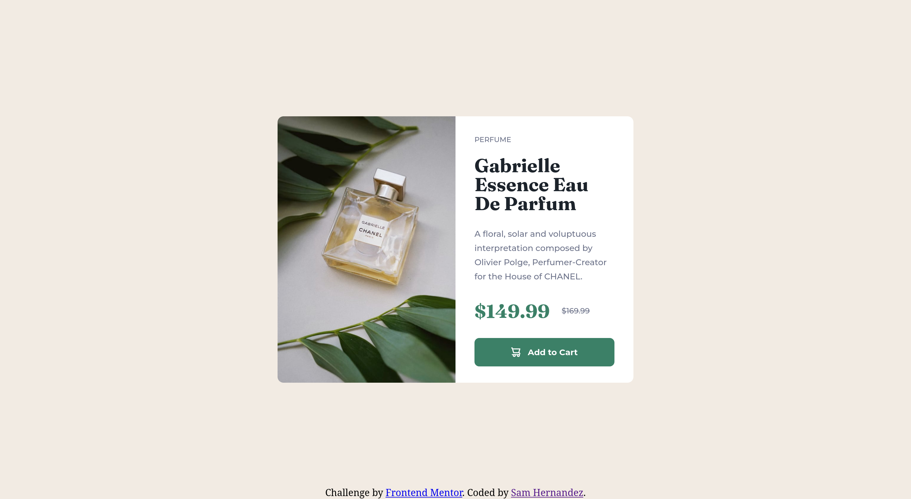

# Frontend Mentor - Product preview card component solution

This is a solution to the [Product preview card component challenge on Frontend Mentor](https://www.frontendmentor.io/challenges/product-preview-card-component-GO7UmttRfa). Frontend Mentor challenges help you improve your coding skills by building realistic projects. 

## Table of contents

- [Overview](#overview)
  - [The challenge](#the-challenge)
  - [Screenshot](#screenshot)
  - [Links](#links)
- [My process](#my-process)
  - [Built with](#built-with)
  - [What I learned](#what-i-learned)
  - [Continued development](#continued-development)
  - [Useful resources](#useful-resources)
- [Author](#author)

## Overview

### The challenge

Users should be able to:

- View the optimal layout depending on their device's screen size
- See hover and focus states for interactive elements

### Screenshot

### Links

- Solution URL: [https://www.frontendmentor.io/solutions/product-preview-card-component-built-using-flexbox-F7Xn14bJ8M](https://www.frontendmentor.io/solutions/product-preview-card-component-built-using-flexbox-F7Xn14bJ8M)
- Live Site URL: [https://s067130h.github.io/product-preview-card-component-main/](https://s067130h.github.io/product-preview-card-component-main/)

## My process

### Built with

- Semantic HTML5 markup
- CSS custom properties
- Flexbox
- Mobile-first workflow

### What I learned

One thing I learned during this projec was how to use the picture and source tags. Instead of writing a script to replace an image, using the picture tag is much easier.

I also learned to pay close attention to my margins and padding when spacing elements. I had a very small amount of padding that was causing my container's height to go a bit beyond what it should. This caused some frustration thinking that I had white space under my image. In reality though, there was just a little too much padding being applied to the content container.

### Continued development

I would like to work more with the picture and source tags in the future. It took some trial and error to figure out exactly how they work, but eventually I got there. 

### Useful resources

- [Responsive images](https://developer.mozilla.org/en-US/docs/Learn/HTML/Multimedia_and_embedding/Responsive_images) - This resource helped me learn more about how to create responsive images without the use of JavaScript.
- [CSS Strikethrough: Use Text-Decoration and Line-Through in CSS](https://blog.udemy.com/css-strikethrough/) - This simple resource was a refresher on how to apply a strike-through decoration on the price element.

## Author

- Frontend Mentor - [@S067130H](https://www.frontendmentor.io/profile/S067130H)

